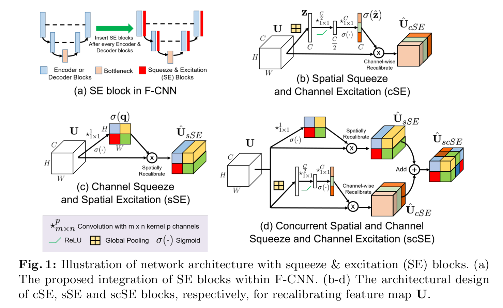

# 卷积模块整理

## 1、SENet

论文：[[1709.01507\] Squeeze-and-Excitation Networks](https://arxiv.org/abs/1709.01507)

采用通道注意力机制，学习通道间的相关性，并生成权重应用于每个特征通道中。

通过SE block显式建模通道间的依赖关系，有效地提升了网络对不同通道特征重要性的适应性和敏感性。这种方法允许网络学会动态地调整各个通道的特征响应，以增强有用的特征并抑制不那么重要的特征。

------

## 2、CBAM

论文：[[1807.06521\] CBAM: Convolutional Block Attention Module](https://arxiv.org/abs/1807.06521)

在SENet的基础上进行改进，除通道注意力模块外还加入了空间注意力模块。其中通道注意力模块采用了平均池化和最大池化共同通过全连接层加和产生权重，并与输入特征相乘。得到的结果再与空间注意力模块产生的权重相乘得到输出特征。

CBAM首次将通道注意力（Channel Attention）和空间注意力（Spatial Attention）顺序结合起来，对输入特征进行两阶段的精炼。这种设计让模型先关注于“哪些通道是重要的”，然后再关注于“空间上哪些位置是重要的”，从而更加全面地捕获特征中的关键信息。

------

## 3、ECA

论文：[[1807.06521\] CBAM: Convolutional Block Attention Module](https://arxiv.org/abs/1807.06521)

在SENet的基础上进行改进，在重标定阶段放弃对权重值的降维再升维的过程，而是应用一维卷积捕捉通道之间的依赖性，卷积核拥有自适应尺寸。这种设计避免了复杂的全连接层结构，减少了模型计算量。

ECA模块根据通道数自适应地调整一维卷积的核大小，使其能够灵活地捕捉不同范围内的通道依赖性，这种自适应机制使得ECA在不同规模的网络和不同深度的层次中都能有效工作。

------

## 4、scSEnet

论文：[[1505.04597\] U-Net: Convolutional Networks for Biomedical Image Segmentation](https://arxiv.org/abs/1505.04597)

对SE注意力模块进行了改进，提出了**cSE、sSE、scSE**三个模块变体，这些模块可以**增强有意义的特征，抑制无用特征**。

**cSE模块**引入了通道注意力机制，可有效的对通道维度的特征信息进行整合增强，这一点与SE等传统通道注意力机制近似，其最大不同的是其对得到的注意力权重进行了降维再升维的操作，类似与resnet中的瓶颈结构以及Fast RCNN目标检测网络最后的全连接加速层，这种操作方式有些奇异值分解的意思，在深度学习模型中十分常见，可有效的整合通道信息，并且简化模块复杂度，减小模型计算量，提升计算速度。

**sSE模块**在特征图的**空间维度**展开信息增强整合，同通道维度一样，其也是通过先提取权重信息，再将权重信息同原始特征图相乘得到注意力增强效果，不过在提取权重信息时是在空间维度展开，**不再是使用全局平均池化层，而是使用输出通道为1，卷积核大小为1×1 的卷积层，进行信息整合**。

**scSE模块**是sSE模块和cSE模块的综合体，即同时对空间维度和通道维度进行信息整合增强，将两者的特征结果沿着通道维度进行相加（结果和原始特征图维度相同）。

scSE模块主要用于增强F-CNN在图像分割任务中的性能，通过对特征图进行自适应的校准来提升网络对图像中重要特征的响应能力。该模块通过同时在空间和通道上对输入特征图进行校准，鼓励网络学习更加有意义、在空间和通道上都相关的特征图。

------

## 5、SimAM

论文：[SimAM: A Simple, Parameter-Free Attention Module for Convolutional Neural Networks](https://proceedings.mlr.press/v139/yang21o.html)

图c即为SimAM模块，受启发于人脑注意力机制，该模块提出一种3D注意力模块并设计了一种能量函数用于计算注意力权值。**不同于现有的通道/空域注意力模块，该模块无需额外参数为特征图推导出3D注意力权值**。该模块的另一个优势在于：**大部分操作均基于所定义的能量函数选择，避免了过多的结构调整**。

所谓的能量函数，即为现有注意力模块的另一个重要影响因素：权值生成方法。现有注意力往往采用额外的子网络生成注意力权值，比如SE的GAP+FC+ReLU+FC+Sigmoid。与其它应用注意力模块的网络相比，SimAM的一个显著优势是它不增加任何额外的参数。这使得SimAM可以轻松地集成到任何现有的CNN架构中，几乎不增加计算成本，且有着非常好的效果。

------

## 6、深度可分离卷积（DWConv）模块

论文：[[1610.02357\] Xception: Deep Learning with Depthwise Separable Convolutions](https://arxiv.org/abs/1610.02357)

#### 逐深度卷积：

简单理解，逐深度卷积就是深度(channel)维度不变，改变H/W。

逐深度卷积（Depthwise convolution，DWConv）与标准卷积的区别在于，深度卷积的卷积核为单通道模式，需要对输入的每一个通道进行卷积，这样就会得到和输入特征图通道数一致的输出特征图。即有输入特征图通道数=卷积核个数=输出特征图个数。

#### 逐点卷积：

简单理解，逐点卷积就是W/H维度不变，改变channel。

根据深度卷积可知，输入特征图通道数=卷积核个数=输出特征图个数，这样会导致输出的特征图个数过少（或者说输出特征图的通道数过少，可看成是输出特征图个数为1，通道数为3），从而可能影响信息的有效性。此时，就需要进行逐点卷积。

逐点卷积（Pointwise Convolution，PWConv）实质上是用1x1的卷积核进行升维。

#### 深度可分离卷积：

深度可分离卷积（Depthwise separable convolution, DSC）由逐深度卷积和逐点卷积组成，深度卷积用于提取空间特征，逐点卷积用于提取通道特征。深度可分离卷积在特征维度上分组卷积，对每个channel进行独立的逐深度卷积（depthwise convolution），并在输出前使用一个1x1卷积（pointwise convolution）将所有通道进行聚合，从而达到减少计算量，提高计算效率的目的。

采用深度可分离卷积来替代普通卷积，通过分离卷积操作为深度和逐点两个独立的步骤，可以大幅减少模型参数数量及计算成本。**在许多经典的轻量化网络模型中都得到广泛的使用，如：Xception、MobileNet等。**

------

## 7、Partial Conv模块

论文：[[2303.03667\] Run, Don't Walk: Chasing Higher FLOPS for Faster Neural Networks](https://arxiv.org/abs/2303.03667)

部分卷积(PConv)的设计利用了特征图内部的冗余，系统地只在输入通道的一部分上应用常规卷积(Conv)，而保留其余通道不变，提供了更高效的运行效率。

在论文提出的FasterNet模型中，PConv被应用于和逐点卷积结合，以更加充分地利用所有通道的信息。这两者的有效接受场类似于一个T形的卷积，更加关注中心位置，与常规卷积在补丁上的均匀处理相比，这提供了一个集中于中心位置的计算视角 。

**在代码中我们可以看到，前向传播主要分为两个策略。**

"forward_slicing" 主要用于推理阶段，在推理时，复制输入张量，然后仅在部分通道上进行卷积操作，保持其余通道不变。避免了对原始输入张量的修改，使得原始输入张量可以在后续的计算中被保留，如用于残差连接。

"forward_split_cat" 可用于训练和推理阶段， 在训练和推理时，该方法将输入张量分割成两部分，对第一部分进行卷积操作，然后将结果与原始未修改的第二部分拼接回来。对于训练过程，通过在部分通道上进行卷积，模型可以学到更适应当前任务的特征。同时，保留了原始未修改的通道，以用于后续的计算。

**该模块可以被应用于与已有的模块结合，以提高运行效率，使网络更加轻量化。**

------

## 8、ParNet模块

论文：[[2110.07641\] Non-deep Networks](https://arxiv.org/abs/2110.07641)

**ParNet Block**在以Rep-VGG block为基础前提下进行修改而成，**旨在不依赖传统的深层架构就能在视觉识别任务中达到高性能**。

如上图最右，构建Skip-Squeeze-Excitation (SSE) 层，避免因3*3卷积非深度网路带来的感受野受限。

SSE层是在SE注意力的基础上提出，由于SE会导致网络深度增加，因此不适合该模块的设计思路。

SiLU激活函数：代替了ReLU。因为非深度网络可能没有足够的非线性，从而限制了其表示能力

**适合应用于浅层神经网络**，在原论文中，一个只有12层的并行结构的浅层网络被提出，结合**ParNet block**，有着很好的应用性能。

------

## 9、ASSP模块

论文：[[1706.05587\] Rethinking Atrous Convolution for Semantic Image Segmentation](https://arxiv.org/abs/1706.05587)

ASPP（Atrous Spatial Pyramid Pooling），空洞空间卷积池化金字塔。可以视为进阶版池化层，其目的与普通的池化层一致，尽可能地去提取特征。

**对于输入图像：**

用1x1卷积进行降维。

用三个不同膨胀率的3x3空洞卷积进行卷积操作，膨胀率可以自定。

用输出尺寸为1x1的全局池化进行池化，接着通过1x1卷积，并进行上采样回到原始输入维度。

最后将这五层的输出在通道数层面进行concat，即把五个通道数相加，然后用1×1卷积层[降维](https://ml-summit.org/cloud-member?uid=c1041&spm=1001.2101.3001.7020)至给定通道数，得到最终输出。这种操作的目的是将不同尺度的空间信息结合起来，从而更好地捕捉多尺度的上下文信息，提高提取特征的能力。

**ASPP 可以作为模块直接插入到现有的卷积神经网络（例如 ResNet 或 MobileNet）中，作为特征提取的增强层。**

------

## 10、GCNet模块

论文：[1904.11492](https://arxiv.org/pdf/1904.11492)

**GCNet (Global Context Network)** 是一种利用**全局上下文（Global Context）信息**来增强深度神经网络能力的模块设计，提出于 2019 年。它的核心目标是通过捕获特征图的全局上下文信息，增强对不同区域之间长距离依赖关系的建模能力，从而提升模型在各种视觉任务上的表现。

**核心思想：**

1. **全局上下文建模**：
   - GCNet 通过对特征图的全局特征进行建模，捕获远距离像素之间的关系。相较于局部感受野的限制，它能更好地表达整个图像的语义信息。
2. **简化计算复杂度**：
   - 相较于非局部模块（Non-local Module），GCNet 在保留全局建模能力的同时，大幅降低了计算复杂度，适合应用于高效的深度网络。
3. **融合通道和空间注意力**：
   - GCNet 同时考虑了特征图的空间关系和通道关系，生成一个全局上下文特征，对输入特征进行增强。

**核心结构组成：**

GCNet 的核心组件是 **GC Block（Global Context Block）**。它的结构可以划分为以下几个部分：

1. **上下文生成模块**：
   - 计算输入特征图的每个位置与全局上下文的关系，生成一个全局上下文特征。
   - 使用 softmax 函数对特征图的每个空间位置进行归一化处理，得到每个位置的权重。
2. **上下文特征增强模块**：
   - 通过 1×1 卷积降低特征维度，减少计算开销。
   - 将全局上下文特征通过加权方式，融合回原始特征图，形成增强后的特征。

**GC Block优势：**

轻量化，即插即用，可以直接插入到已有网络中。

------

## 11、Unet

论文：[[1505.04597\] U-Net: Convolutional Networks for Biomedical Image Segmentation](https://arxiv.org/abs/1505.04597)

Unet于2015年发表在MICCAI，是针对于生物医学影像提出的用于图像语义分割的全卷积神经网络。Unet为编码器-解码器架构，因整体架构形似"U"而得名。

**核心结构组成：**

**Encoder：**下采样的编码器部分负责提取图像特征，缩小图像尺寸的同时扩大通道数，使图像空间维度减小，特征维度增加。

**Decoder：**上采样的解码器部分负责还原图像的原分辨率，对尺寸缩小的图像进行反卷积，扩大图像尺寸并减少通道数，同时将下采样过程中的图像经过尺寸裁剪（一般取中心部分）后在通道维度上和上采样过程中的图像拼接，以保留图像的一些细节信息，减少信息丢失。

最后，还原后的图像通过一个1x1的卷积核减少通道数，得到输出，**输出的通道数和分割的类别数相等，但是输出的图像尺寸和原输入图像尺寸不一致**。

------

## 12、VGGNet

VGGNet是2014年由牛津大学[计算机视觉](https://edu.csdn.net/cloud/sd_summit?utm_source=glcblog&spm=1001.2101.3001.7020)组合和Google DeepMind公司研究员一起研发的深度卷积神经网络。它探索了卷积神经网络的深度和其性能之间的关系，通过反复的堆叠3x3的小型卷积核和2x2的最大池化层，成功的构建了16~19层深的卷积神经网络。

**VGGNet全部使用3\*3的卷积核和2\*2的池化核，通过不断加深网络结构来提升性能**。同时第一次应用了block的设计，即把核心卷积层集合到一个block里，每个block的末尾添加池化，最后接全连接层。在不同次数上重复block从而得到不同的架构。该设计被后续许多经典卷积神经网络沿用。

------

## 13、ResNet

 论文：[[1512.03385\] Deep Residual Learning for Image Recognition](https://arxiv.org/abs/1512.03385)

ResNet是2015年由微软实验室的何凯明等几位大神提出的深度卷积网络模型，利用残差连接的思路，解决了深度网络中网络退化的问题，使深度网络的性能能够在浅层网络的基础上更有效。ResNet的出现对深度神经网络来说具有重大的历史意义。

**模型思路：**

在设计卷积网络模型时，考虑到如果保持浅层网络的权重不变，在浅层网络的基础上加上几层网络，形成的网络性能应该至少不能比之前的差。即：深的网络新加的那些层，总是可以把这些层学习的变成一个**identity mapping**（输入是x，输出也是x，等价于可以把一些权重学成比如说简单的n分之一，是的输入和输出是一一对应的），但是实际情况是，虽然理论上权重是可以学习成这样，但是实际上做不到：假设让SGD（随机梯度下降）去优化，深层学到一个跟那些浅层网络精度比较好的一样的结果，上面的层变成identity（相对于浅层神经网络，深层神经网络中多加的那些层全部变成identity），这样的话精度不应该会变差，应该是跟浅层神经网络是一样的，但是实际上SGD找不到这种最优解。

因此这篇文章提出显式地构造一个identity mapping，称为deep residual learning framework，来解决深层网络精度变差的问题。这样的好处是：**只是加了一个原先的值进来，没有任何可以学的参数，不会增加任何的模型复杂度，也不会使计算变得更加复杂，而且这个网络跟之前一样，也是可以训练的，没有任何改变。**

- 其中右侧弯曲的线应用了shortcut connections短路连接，即跳过一些层，并采用了identity mapping使输入和输出一致。
- 左侧流程即为残差连接，对残差进行更深网络的学习，最后将两个连接的输出加和并做relu激活，即为最终结果。

**残差连接如何处理输入和输出形状不同的情况：**

   1.**全连接层做投影（Projection Shortcut）**：

- 当输入和输出的维度不匹配时，可以通过一个全连接层（也称为线性层）来调整输入的形状，使其与输出的形状相匹配。这个全连接层通常包含权重和偏置，可以学习如何将输入投影到输出空间。
- 例如，如果输入特征是256维，而输出特征是512维，可以通过一个全连接层将输入投影到512维，然后再与输出特征相加。

   2.**卷积层做投影（Convolutional Shortcut）**：

- 在卷积神经网络（CNN）中，如果输入和输出的通道数不同，可以使用一个1x1的卷积层来调整输入的通道数，使其与输出的通道数相匹配。
- 1x1卷积层可以看作是一种特殊的全连接层，它在空间维度上保持不变，只改变通道数。

网络层数很深的情况（大于50），引入bottleneck的设计。深层网络下，为了学到更多模式，通道数可以变得更大。但此时计算量会平方倍变大，此时通过1x1卷积投影回去再做卷积再1x1投影回大通道数。

示意图如下：

具体的模型参数如下：

ResNet的出现为解决深度网络模型退化的问题贡献了思路，避免了梯度消失和梯度爆炸的问题，提高了模型的性能和精度。其中shortcut连接和残差连接的思路被后人广泛学习。

------

## 14、Inception-ResNet

论文：[[1602.07261\] Inception-v4, Inception-ResNet and the Impact of Residual Connections on Learning](https://arxiv.org/abs/1602.07261)

Inception模块是经典模型GoogLeNet中核心的子网络结构，最早于2014年提出，并在随后两年内不断改进，相继提出了v1-v4结构。GoogLeNet的核心在于使用Inception块，将输入分散到不同路径经过不同卷积层，最后在通道维度上合并（即不同路径的输出大小一致，通道数相加）得到输出。

- 由此可以得出，Inception通过各种块的设计以及通过1 * 1的卷积层来降低通道数，从而使得参数数量和计算量大幅度减少
- Inception的优点：不仅增加了网络结构的多样性（有大量不同设置的卷积层），而且参数数量和计算量都显著降低了

**GoogLeNet中使用的Inception v1结构：**

后续提出的Inception v2、v3、v4对于原结构做了不同程度的改进：

- **Inception v2**：
  - 卷积核的因式分解，将大卷积核分解为多个小卷积核，如将v1结构中的5×5卷积核替换为2个3×3卷积核，减少了计算量。
  - 于卷积层与激活函数之间插入BN层：Conv-BN-ReLU。
- **Inception v3**：
  - 引入了非对称卷积（3x1 和 1x3 的组合代替3x3卷积）来减少计算量。（实际上，作者发现在网络的前期使用这种分解效果并不好。）
  - 使用标签平滑来避免过度拟合。
- **Inception v4**：
  - 引入了残差连接（Inception-ResNet），显著提高了训练稳定性和效率。
  - 深入优化了网络的架构，增强了模型表现。

2016年Resnet网络的提出为深度网络模型解决梯度爆炸或消失问题贡献了思路，Inception-ResNet（即Inception-v4）就是在Resnet贡献的残差连接的思路上提出，从而改进上一版v3结构。

上图即为架构中的其中一个Inception-ResNet module块。将残差模块的卷积结构替换为Inception结构，即得到Inception Residual结构。除了上述图片中的结构外，作者通过20个类似的模块进行组合，最后形成了InceptionV4的网络结构，构建了Inception-ResNet模型，如下图所示。

给出的代码包含了Inception-ResNet的所有module和论文提出的整体架构搭建方法以供参考。

此外，2017年提出的Xception模型是由Inception结构加上depthwise separable convlution，再加上残差网络结构改进而来。

------

## 15、Xception

论文：[[1610.02357\] Xception: Deep Learning with Depthwise Separable Convolutions](https://arxiv.org/abs/1610.02357)

受启发于Inception，Xception将 Inception 模块替换为深度可分离卷积（DWconv），同时加入残差网络结构。

**Xception** 与 **Inception V3** 具有相同数量的参数，但由于模型参数的更有效使用，其性能得到进一步的提高。

如图即为Xception模块结构，将所有 1×1卷积进行拼接，进行通道维度的逐点卷积，并使3×3卷积的数量与1×1卷积输出通道的数量相等，进行空间维度的逐通道卷积。

上图即为Xception的整体架构，Xception包含三个部分：输入部分，中间部分和结尾部分；其中有36个卷积层用于特征提取，36个卷积层放到14个模块中，除了首尾模块，其余的都用线性残差进行连接。

**模型特点：**参数量更少，准确率更高，更加轻量化。

------

## 16、ShuffleNet V2

论文：[arxiv.org/pdf/1807.11164](https://arxiv.org/pdf/1807.11164)

在2018年针对不仅仅依靠减少模型复杂度来提高模型速度的思路而提出。

(a)ShuffleNet 基本单元；(b) 用于空间下采样 (2×) 的 ShuffleNet 单元；(c) ShuffleNet V2 的基本单元；(d) 用于空间下采样 (2×) 的 ShuffleNet V2 单元；

a和b是ShuffleNetV1采用的模块结构。在此基础上，V2针对基本单元增加了Channel Split操作，把输入特征图在通道维度上分为2个部分。取消组卷积，改用1x1卷积，后接深度可分离卷积。在分支合并时，将add加和改为在通道维度上concat。最后对结果进行channel shuffle，即在通道concat后，将不同组的通道重新混合排列，保证两个分支的信息交流。

**channel shuffle重排过程**：

同时，对于下采样模块，不再有channel split，而是每个分支都有stride=2的下采样，最后concat在一起后，特征图空间大小减半，通道数翻倍。

优势：在很小的复杂度中有良好的精度，效果优于ResNet、MobileNet、Xception等。

ShuffeNet v2也可作为与其他技术相结合，进一步提升性能，如配备Squeezeand-excitation（SE）模块，在速度损失的前提下提升了模型精度。

------

## 17、ResNext

## 18、Res2Net

## 19、DenseNet

论文：[[1608.06993v5\] Densely Connected Convolutional Networks](https://arxiv.org/abs/1608.06993v5)

DenseNet于2017年提出，是对ResNet思路进一步的改造。其采用了密集连接的机制，即相互连接所有的层，每个层都会与前面所有的层在通道的维度上连接在一起（`Channel-wise concatenation`）, 实现特征重用，作为下一层的输入。这样不但减缓了梯度消失的现象，也使其可以在参数和计算量更少的情况下实现比ResNet更优的性能。

上图即为DenseBlock的结构示意，内部包含**BN+ ReLU + 3x3 Conv**。

如上图所示，DenseNet的架构由DenseBlock和Transition Layer组成。因为DenseNet的稠密连接方式需要从通道维度上concat在一起，所以在每个DenseBlock中，特征映射的大小是相同的，无需改变图像尺寸。

Transition Layer为过渡层，结构为**BN+ReLU+1x1Conv+2x2AvgPooling**。其用来连接两个相邻的block，降低特征图的大小。

**优势：**

在ResNet的基础上进一步增强了梯度流动，减轻梯度消失的现象。

对于每一层，ResNet中的参数数量与C × C C×CC×C成正比，DenseNet中的参数数量与l × k × k l\times k\times kl×k×k成正比。
由于k远小于C, 因此DenseNet 比 ResNet要小很多，进一步提升了计算效率。

DenseNet中的每一层都接收前面所有的层作为输入，因此能够感受到更加多样化的特征。同时由于浅层的特征输出直接传到深层并输出，使其浅层特征得到保留，使其倾向于给出更平滑的决策边界。这也解释了为什么训练数据不足时DenseNet表现依旧良好。

**为什么DenseNet的应用范围不如ResNet广泛？**

**计算复杂度和内存消耗**： DenseNet 每一层都与前面的所有层连接，这导致输入和输出的张量不断增加，因此需要更多的计算和内存资源。相比之下，ResNet 采用的是跳跃连接（skip connections），每层只与前面的部分层连接，计算效率更高，内存开销较小。

**训练难度**： DenseNet 的密集连接虽然有助于信息流动和梯度传播，但层与层之间的复杂关系可能使训练变得更加困难，尤其是在深层网络中。ResNet 的跳跃连接使得梯度能够更容易地反向传播，训练相对更加简单。

**结构复杂性和实现难度**： DenseNet 需要更复杂的连接管理和更多的参数，这使得网络架构的设计和实现变得更为复杂，尤其是在规模较大的情况下。相比之下，ResNet 的结构更加简洁，易于理解和实现。

**可扩展性**： ResNet 可以轻松扩展到不同规模的网络（如 ResNet-18、ResNet-34、ResNet-50 等），并且有大量预训练模型可供使用。而 DenseNet 的计算和内存要求较高，扩展性较差，尤其是在计算资源受限的环境中。

**社区支持与工业应用**： 由于 ResNet 的较低计算开销和较高的效率，它得到了广泛的社区支持，并在工业界得到了广泛应用。相对而言，DenseNet 的应用场景较为有限，通常在一些特定领域（如医学影像分析）中有较好的表现。

------

## 20、Darknet

论文：[1804.02767](https://arxiv.org/pdf/1804.02767)

Darknet-53于2018年提出，是YOLO v3 的 backbone。其借鉴了 Resnet 的设计思想，引入了 shoutcut和残差连接的思路。

上图即为Darknet53的架构。输入为416*416像素大小的图像，经过一系列卷积操作后，输出为13x13x1024的张量。这个张量可以传递给YOLOv3中的检测头，用于检测图像中的物体。

其中Convolutional层和Residual层的结构如下图所示。

------

## 21、EfficientNet V2

## 22、Fire模块

论文：https://arxiv.org/abs/1602.07360

Fire Module于2016年提出，用作SqueezeNet的基础模块。

如上图，使用的基础模块称为fire。包含三个卷积层，步长均为1。分为squeeze和expand两部分，分别压缩和扩展数据的通道数。expand部分中，两个不同核尺寸的结果在concat层在通道维度上合并输出。

fire模块有三个可调参数: 

*N*：squeeze部分，1x1卷积层的通道数

*c1*：expand部分，1x1卷积层的通道数

*c2*：expand部分，3x3卷积层的通道数

输入输出尺寸相同。输入通道数不限，输出通道数为*c1+c2*。在SqueezeNet论文中采用了*c1=c2=4N*的参数。

**特点：**

- 通过squeeze layer限制通道数量，减少参数量；
- 使用1×1卷积核代替3×3卷积核，减少参数量；
- 借鉴Inception思想，将不同卷积核输出的结果进行concat；为了使输出的图像尺寸相同，3x3卷积进行了padding。

------

## 23、Inverted Residual Block倒置残差模块

论文：[1801.04381](https://arxiv.org/pdf/1801.04381)

Inverted Residual Block倒置残差模块是2018年提出的mobilenetV2中应用的模块。

它和残差块Residual block的区别在于：残差块是先1x1卷积降维，经过3x3卷积处理，再通过1x1卷积升维。而倒置残差则是先升维再降维，同时将普通3x3卷积替换成了DWconv深度可分离卷积。

从这张图中我们可以看到，Inverted residual block的最后一层使用的是线性的激活函数，这是因为ReLU激活函数会对低维度的特征造成较大的损失，而在最后一层连接的又是一个维度较低的特征矩阵，为了减小损失而使用线性的激活函数。

**优势：**

在倒置残差块中用DWconv代替普通卷积减少参数量，可以保证网络轻量化的特点。

通过线性激活保持特征空间的完整性，避免非线性激活函数对特征的破坏，特别是高维特征中细粒度信息的丢失。

## 24、Ghost模块

