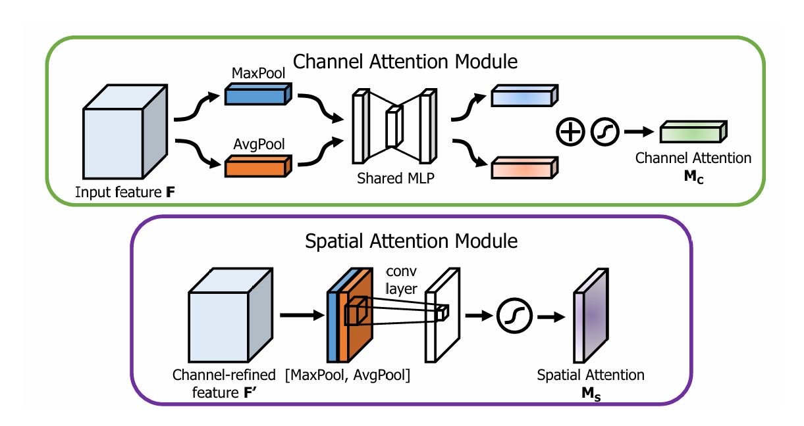

# 卷积模块整理

## 1、SENet

论文：[[1709.01507\] Squeeze-and-Excitation Networks](https://arxiv.org/abs/1709.01507)

采用通道注意力机制，学习通道间的相关性，并生成权重应用于每个特征通道中。

通过SE块显式建模通道间的依赖关系，有效地提升了网络对不同通道特征重要性的适应性和敏感性。这种方法允许网络学会动态地调整各个通道的特征响应，以增强有用的特征并抑制不那么重要的特征。

------

## 2、CBAM

论文：[[1807.06521\] CBAM: Convolutional Block Attention Module](https://arxiv.org/abs/1807.06521)

在SENet的基础上进行改进，除通道注意力模块外还加入了空间注意力模块。其中通道注意力模块采用了平均池化和最大池化共同通过全连接层加和产生权重，并与输入特征相乘。得到的结果再与空间注意力模块产生的权重相乘得到输出特征。

CBAM首次将通道注意力（Channel Attention）和空间注意力（Spatial Attention）顺序结合起来，对输入特征进行两阶段的精炼。这种设计让模型先关注于“哪些通道是重要的”，然后再关注于“空间上哪些位置是重要的”，从而更加全面地捕获特征中的关键信息。

------

## 3、ECA

论文：[[1807.06521\] CBAM: Convolutional Block Attention Module](https://arxiv.org/abs/1807.06521)

在SENet的基础上进行改进，在重标定阶段放弃对权重值的降维再升维的过程，而是应用一维卷积捕捉通道之间的依赖性，卷积核拥有自适应尺寸。这种设计避免了复杂的全连接层结构，减少了模型计算量。

ECA模块根据通道数自适应地调整一维卷积的核大小，使其能够灵活地捕捉不同范围内的通道依赖性，这种自适应机制使得ECA在不同规模的网络和不同深度的层次中都能有效工作。

------

## 4、scSEnet

论文：[[1803.02579\] 在全卷积网络中并发空间和通道压缩和激励](https://arxiv.org/abs/1803.02579)

对SE注意力模块进行了改进，提出了**cSE、sSE、scSE**三个模块变体，这些模块可以**增强有意义的特征，抑制无用特征**。

**cSE模块**引入了通道注意力机制，可有效的对通道维度的特征信息进行整合增强，这一点与SE等传统通道注意力机制近似，其最大不同的是其对得到的注意力权重进行了降维再升维的操作，类似与resnet中的瓶颈结构以及Fast RCNN目标检测网络最后的全连接加速层，这种操作方式有些奇异值分解的意思，在深度学习模型中十分常见，可有效的整合通道信息，并且简化模块复杂度，减小模型计算量，提升计算速度。

**sSE模块**在特征图的**空间维度**展开信息增强整合，同通道维度一样，其也是通过先提取权重信息，再将权重信息同原始特征图相乘得到注意力增强效果，不过在提取权重信息时是在空间维度展开，**不再是使用全局平均池化层，而是使用输出通道为1，卷积核大小为1×1 的卷积层，进行信息整合**。

**scSE模块**是sSE模块和cSE模块的综合体，即同时对空间维度和通道维度进行信息整合增强，将两者的特征结果沿着通道维度进行相加（结果和原始特征图维度相同）。

scSE模块主要用于增强F-CNN在图像分割任务中的性能，通过对特征图进行自适应的校准来提升网络对图像中重要特征的响应能力。该模块通过同时在空间和通道上对输入特征图进行校准，鼓励网络学习更加有意义、在空间和通道上都相关的特征图。

------

## 5、SimAM

论文：[SimAM: A Simple, Parameter-Free Attention Module for Convolutional Neural Networks](https://proceedings.mlr.press/v139/yang21o.html)

图c即为SimAM模块，受启发于人脑注意力机制，该模块提出一种3D注意力模块并设计了一种能量函数用于计算注意力权值。**不同于现有的通道/空域注意力模块，该模块无需额外参数为特征图推导出3D注意力权值**。该模块的另一个优势在于：**大部分操作均基于所定义的能量函数选择，避免了过多的结构调整**。

所谓的能量函数，即为现有注意力模块的另一个重要影响因素：权值生成方法。现有注意力往往采用额外的子网络生成注意力权值，比如SE的GAP+FC+ReLU+FC+Sigmoid。与其它应用注意力模块的网络相比，SimAM的一个显著优势是它不增加任何额外的参数。这使得SimAM可以轻松地集成到任何现有的CNN架构中，几乎不增加计算成本，且有着非常好的效果。

------

## 6、深度可分离卷积

#### 逐深度卷积：

简单理解，逐深度卷积就是深度(channel)维度不变，改变H/W。

逐深度卷积（Depthwise convolution，DWConv）与标准卷积的区别在于，深度卷积的卷积核为单通道模式，需要对输入的每一个通道进行卷积，这样就会得到和输入特征图通道数一致的输出特征图。即有输入特征图通道数=卷积核个数=输出特征图个数。

#### 逐点卷积：

简单理解，逐点卷积就是W/H维度不变，改变channel。

根据深度卷积可知，输入特征图通道数=卷积核个数=输出特征图个数，这样会导致输出的特征图个数过少（或者说输出特征图的通道数过少，可看成是输出特征图个数为1，通道数为3），从而可能影响信息的有效性。此时，就需要进行逐点卷积。

逐点卷积（Pointwise Convolution，PWConv）实质上是用1x1的卷积核进行升维。

#### 深度可分离卷积：

深度可分离卷积（Depthwise separable convolution, DSC）由逐深度卷积和逐点卷积组成，深度卷积用于提取空间特征，逐点卷积用于提取通道特征。深度可分离卷积在特征维度上分组卷积，对每个channel进行独立的逐深度卷积（depthwise convolution），并在输出前使用一个1x1卷积（pointwise convolution）将所有通道进行聚合，从而达到减少计算量，提高计算效率的目的。

采用深度可分离卷积来替代普通卷积，通过分离卷积操作为深度和逐点两个独立的步骤，可以大幅减少模型参数数量及计算成本。在许多已有的模型中都有广泛的使用。

------

## 7、Partial Conv

论文：[[2303.03667\] Run, Don't Walk: Chasing Higher FLOPS for Faster Neural Networks](https://arxiv.org/abs/2303.03667)

部分卷积(PConv)的设计利用了特征图内部的冗余，系统地只在输入通道的一部分上应用常规卷积(Conv)，而保留其余通道不变，提供了更高效的运行效率。

在论文提出的FasterNet模型中，PConv被应用于和逐点卷积结合，以更加充分地利用所有通道的信息。这两者的有效接受场类似于一个T形的卷积，更加关注中心位置，与常规卷积在补丁上的均匀处理相比，这提供了一个集中于中心位置的计算视角 。

**在代码中我们可以看到，前向传播主要分为两个策略。**

"forward_slicing" 主要用于推理阶段，在推理时，复制输入张量，然后仅在部分通道上进行卷积操作，保持其余通道不变。避免了对原始输入张量的修改，使得原始输入张量可以在后续的计算中被保留，如用于残差连接。

"forward_split_cat" 可用于训练和推理阶段， 在训练和推理时，该方法将输入张量分割成两部分，对第一部分进行卷积操作，然后将结果与原始未修改的第二部分拼接回来。对于训练过程，通过在部分通道上进行卷积，模型可以学到更适应当前任务的特征。同时，保留了原始未修改的通道，以用于后续的计算。

该模块可以被应用于与已有的模块结合，以提高运行效率，使网络更加轻量化。

------

## 8、ParNet

论文：[[2110.07641\] Non-deep Networks](https://arxiv.org/abs/2110.07641)

ParNet Block在以Rep-VGG block为基础前提下进行修改而成，**旨在不依赖传统的深层架构就能在视觉识别任务中达到高性能**。

感受野：构建Skip-Squeeze-Excitation (SSE) 层，避免因3*3卷积非深度网路带来的感受野受限。

SSE层是在SE注意力的基础上提出，由于SE会导致网络深度增加，因此不适合该模块的设计思路。

SiLU激活函数：代替了ReLU。因为非深度网络可能没有足够的非线性，从而限制了其表示能力

**适合应用于浅层神经网络**，在原论文中，一个只有12层的并行结构的浅层网络被提出，结合ParNet block，有着很好的应用性能。

------

## 9、ASSP

论文：[[1706.05587\] Rethinking Atrous Convolution for Semantic Image Segmentation](https://arxiv.org/abs/1706.05587)

ASPP（Atrous Spatial Pyramid Pooling），空洞空间卷积池化金字塔。进阶版池化层，其目的与普通的池化层一致，尽可能地去提取特征。

**对于输入图像：**

用1x1卷积进行降维。

用三个不同膨胀率的3x3空洞卷积进行卷积操作，膨胀率可以自定。

用输出尺寸为1x1的全局池化进行池化，接着通过1x1卷积，并进行上采样回到原始输入维度。

最后将这五层的输出在通道数层面进行concat，即把五个通道数相加，然后用1×1卷积层[降维](https://ml-summit.org/cloud-member?uid=c1041&spm=1001.2101.3001.7020)至给定通道数，得到最终输出。这种操作的目的是将不同尺度的空间信息结合起来，从而更好地捕捉多尺度的上下文信息，提高提取特征的能力。

ASPP 可以作为模块直接插入到现有的卷积神经网络（例如 ResNet 或 MobileNet）中，作为特征提取的增强层。

------

## 10、GCNet

论文：[1904.11492](https://arxiv.org/pdf/1904.11492)

**GCNet (Global Context Network)** 是一种利用**全局上下文（Global Context）信息**来增强深度神经网络能力的模块设计，提出于 2019 年。它的核心目标是通过捕获特征图的全局上下文信息，增强对不同区域之间长距离依赖关系的建模能力，从而提升模型在各种视觉任务上的表现。

### **GCNet 的核心思想**

1. **全局上下文建模**：
   - GCNet 通过对特征图的全局特征进行建模，捕获远距离像素之间的关系。相较于局部感受野的限制，它能更好地表达整个图像的语义信息。
2. **简化计算复杂度**：
   - 相较于非局部模块（Non-local Module），GCNet 在保留全局建模能力的同时，大幅降低了计算复杂度，适合应用于高效的深度网络。
3. **融合通道和空间注意力**：
   - GCNet 同时考虑了特征图的空间关系和通道关系，生成一个全局上下文特征，对输入特征进行增强。

### **GCNet 的结构组成**

GCNet 的核心组件是 **GC Block（Global Context Block）**。它的结构可以划分为以下几个部分：

1. **上下文生成模块**：
   - 计算输入特征图的每个位置与全局上下文的关系，生成一个全局上下文特征。
   - 使用 softmax 函数对特征图的每个空间位置进行归一化处理，得到每个位置的权重。
2. **上下文特征增强模块**：
   - 通过 1×1 卷积降低特征维度，减少计算开销。
   - 将全局上下文特征通过加权方式，融合回原始特征图，形成增强后的特征。